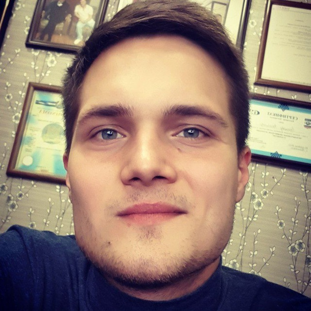

## Naumov Nikita

# My contacts

- address: Uzbekistan, Tashkent, st. Dustlik-1
- Phone number: +998998077353
- Telegramm: [@naumovn808]( https://t.me/naumovn808)
- E-mail: naumovn808@gmail.com
- GitHub: [https://github.com/naumovn808](https://github.com/naumovn808)
- Discord: Nikita Naumov (@naumovn808)

## Summary

I am a beginner front-end developer. Recently graduated from the front-end developer course from htmlacademy.ru. No work experience at the moment. I want to develop further in this direction, deepen my knowledge of java-script and also study application design approaches and their architecture. I'm starting an internship at an outsourcing company from the academy. In my free time I try to learn something new in the field of WEB.

## Skills

- HTML
- CSS (SCSS, LESS, BEM methodology)
- javascript(Fundamentals, Functional Programming, ES6+, DOM, JSON, OOP)
- Git, GitHub
- Module Bundler: Gulp
- Windows OS
- Figma(for web development)
- Editors: VSCode

## Code examples
```
const whatTimeIsIt = function (angle) {
    if (angle) {

        if (angle > 360 || typeof angle != 'number') return false

        if (angle === 0 || angle === 360) return "12:00"

        let percents = (360 / angle);
        let minuts = (60 * 12) / percents;
        let hour = 12;

        if (minuts >= 60) {
            hour = Math.floor(minuts / 60);
        }
        let remMinuts = minuts % 60;

        return `${hour < 10 ? `0${hour}` : `${hour}`}:${remMinuts < 10 ? `0${Math.floor(remMinuts)}` : `${Math.floor(remMinuts)}`}`
    } else return false
}

 console.log(whatTimeIsIt(31)); --> "01:02"
 console.log(whatTimeIsIt(90)); --> "03:00 "
```

## Education

- Tashkent Transport Professional College
- course front-end developer from https://htmlacademy.ru
- Course "JavaScript/​DOM/​Interfaces" for beginners from https://learn.javascript.ru/

## Experience

I have little experience in JS and Frontend development. I am doing an internship and taking small orders for freelance

my latest works : [cat-energy](https://naumovn808.github.io/2068313-cat-energy-26/), [keksobooking](https://naumovn808.github.io/2068313-keksobooking-27/), [smart_device](https://naumovn808.github.io/smart_device/), [online-shop "Bangkok Express"](https://github.com/naumovn808/jsbasic-20220211_naumovn8080),[glacy](https://naumovn808.github.io/2068313-gllacy-34/)

## Languages

- Russian
- English A2+ I am currently taking English courses as well.
